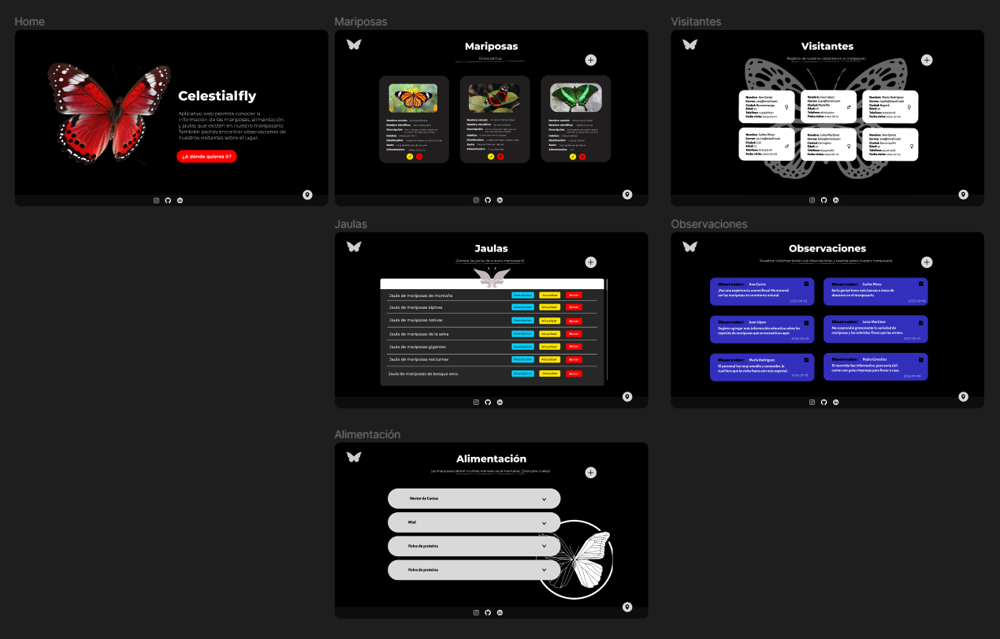

# Celestialfly 🦋
## Aplicativo Web FullStack 💻

Sistema de gestión integral diseñado específicamente para el mariposario 'Celestialfly', con el objetivo de mejorar la organización, interactividad y eficiencia en la administración de información relacionada con mariposas y su entorno. 

Este sistema aprovecha las tecnologías modernas de desarrollo web y utiliza una API REST para ofrecer funcionalidades de CRUD (Crear, Leer, Actualizar y Eliminar) en todas las áreas clave del mariposario. Siendo esta una propuesta comercial, donde mediante un aplicativo web se muestra la funcionalidad del negocio a nivel operativo. 

Su desarrollo se enfoca en el stack MERN, mostrando un planteamiento de negocio con el primer MVP (Minimo Producto Viable) del aplicativo web.

## Índice 📑


- [Wireframe diseñado con Figma](#wireframe-diseñado-con-figma)

- [Diagrama de base de datos no relacional](#diagrama-de-base-de-datos-no-relacional)

- [Documentacion backend](#documentacion-backend)

- [¿Cómo utilizar el software?](#cómo-utilizar-el-software)

- [Más información](#más-info)
  - [Tecnologías utilizadas](#tecnologías-utilizadas)
  - [Depencias](#dependencias)
  - [Contribuciones y licencia](#contribuciones-y-licencia)


## Wireframe diseñado con Figma 📍

Para mayor entendimiento del usuario, se construyó un wireframe a nivel UI/UX para conocer la interfaz de usuario a trabajar para construir el aplicativo web fullstack, en el siguiente link encontrará una mayor información del sistema especificado:

- [Link de wireframe base con Figma](https://www.figma.com/file/UhndheY9j4diY5mwWGtf8n/Untitled?type=design&node-id=0%3A1&mode=design&t=QOAsz9nzaquKcICX-1)

- Imagen de referencia:

<div>
    
<div>


## Diagrama de base de datos no relacional 🔰

Se construyó un modelo de diagrama de base de datos no relacional como la estructura trabajado en MongoDB para el almacenamiento de datos del mariposario, presentado a continuación:

<div>
    
<div>


## Documentación backend

Se construyó una documentación con Swagger para los endpoints crud api del almacenamiento de datos del mariposario, presentado a continuación:
- [Documentacion Swagger](http://localhost:8020/api-doc/#/)
-> Funcionará siempre y cuando ya hayas comenzado los servidores back-end y front-end


## ¿Cómo utilizar el software? 💻

Para poder usar este sistema en tu computador, tendrás que instalarlo y utilizarlo localmente, y necesitarás tener instalados los siguientes requisitos:


<div align="center"> Node.js 🚀 </div>
<br>


Para poder instalarlo, sigue los siguientes pasos:

1. Clona el repositorio: `https://github.com/Zachlesk/Aplicativo-Web-FULLSTACK.git`
`

## Primer procedimiento 

2. Entrar a la carpeta 'frontend' e inicializa el host con React

    ```bash
    cd frontend
    ```

3. Desde la terminal e instala las dependencias con el siguiente comando:

    ```bash
    npm install
    ```

4. Una vez instaladas las dependencias vamos a abrir una nueva terminal y ejecutamos el software:

    ```bash
    npm start
    ```

5. En la consola, visualizarás el siguiente mensaje: 
    ```bash
    Server is running on port ${PORT}
    ```
<br>
-> ¡Listo! Tu servidor para front-end está en funcionamiento.

<hr>

## Segundo procedimiento

1. Entrar a la carpeta 'backend' e inicializa el servidor Node.js para el api

    ```bash
    cd backend
    ```

2. Desde la terminal e instala las dependencias con el siguiente comando:

    ```bash
    npm install
    ```

3. Una vez instaladas las dependencias vamos a abrir una nueva terminal y ejecutamos el software:

    ```bash
    npm run dev
    ```

4. En la consola, visualizarás el siguiente mensaje: 
    ```bash
    Server is running on port ${PORT}
    ```
<br>
-> ¡Listo! Tu servidor para back-end está en funcionamiento.

<hr>

## Más información ⬇️

### Tecnologías Utilizadas 👨‍💻

- Node.js
- Expres.js
- MongoDB
- React


### Dependencias 🚨

- [dotenv](https://www.npmjs.com/package/dotenv) : Biblioteca para cargar variables de entorno desde un archivo `.env` en el entorno de Node.js
- [express](https://expressjs.com/) : Un marco de aplicación web minimalista y flexible para Node.js que facilita la creación de aplicaciones web y APIs.
- [mongodb](https://www.npmjs.com/package/mongodb) : El controlador oficial de MongoDB para Node.js, que permite interactuar con bases de datos MongoDB
- [nodemon](https://www.npmjs.com/package/nodemon) : Una herramienta que monitoriza cambios en archivos y automáticamente  reinicia la aplicación Node.js para un flujo de desarrollo más eficiente


<br>

<hr>

### Contribuciones y licencia 👤

¡Agradecemos tus contribuciones al proyecto! Si deseas colaborar, sigue los siguientes pasos:

1. Crea un nuevo "branch" para tus cambios.

   ```shell
   git checkout -b tus-cambios 
   ```

2. Realiza tus modificaciones y mejoras.

3. Haz un "commit" de tus cambios.

   ```shell
   git commit -m "Especificaciones generales de cambios y/o novedades"      
   ```

4. Envía tus cambios al repositorio remoto.

   ```shell
   git push origin tus-cambios 
   ```

4. Abre un "**pull request**" en GitHub para que revisemos tus cambios.

Este proyecto se encuentra bajo la Licencia MIT. Siéntete  libre de utilizar, modificar y distribuir el código según tus  necesidades.

¡Gracias por contribuir al proyecto 'Celestialfly'! 